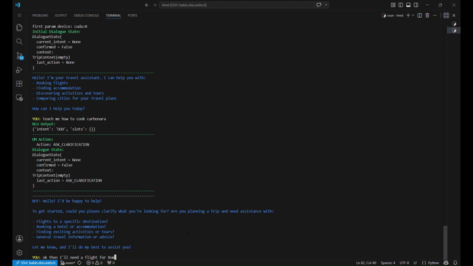

# AI Travel Planner 

A modular, LLM-powered conversational system for travel planning, developed as part of the Human-Machine Dialogue course at the University of Trento. Users can book flights, accommodations, and activities through natural multi-turn conversation.



[Watch the full demo](https://youtu.be/FQuBQqjFYmw)

---
## Architecture

The system implements a four-stage NLU → DM → NLG pipeline:

| Module | File | Description |
|---|---|---|
| **Intent Splitter** | `intent_splitter.py` | Detects and segments multi-intent utterances; queues subsequent intents for sequential processing |
| **NLU** | `nlu.py` | Extracts intent and slot values from user input using Llama 3.1 8B Instruct; optionally conditioned on dialogue state for grounding |
| **DM** | `dm.py` | Manages dialogue state and selects the next system action from a constrained schema; supports both a rule-based and an LLM-based variant |
| **NLG** | `nlg.py` | Generates context-conditioned natural-language responses based on the selected action and current state |
| **API Tool** | `amadeus.py` | Executes external API calls (Amadeus for flights, hotels, and activities; OpenStreetMap Nominatim for geocoding) |

---

## Supported Intents and Slots

| Intent | Required Slots |
|---|---|
| `BOOK_FLIGHT` | `origin`, `destination`, `departure_date`, `num_passengers`, `budget_level` |
| `BOOK_ACCOMMODATION` | `destination`, `check_in_date`, `check_out_date`, `num_guests`, `budget_level` |
| `BOOK_ACTIVITY` | `destination`, `activity_category`, `preferred_date`,`preferred_time`, `budget_level` |
| `COMPARE_CITIES` | `city1`, `city2`, `activity_category` |
| `END_DIALOGUE` | — |
| `OOD` | — (triggers clarification) |

Optional slot: `return_date` (for `BOOK_FLIGHT`).

---

## Requirements

- Python 3.10+
- A HuggingFace token with access to [meta-llama/Llama-3.1-8B-Instruct](https://huggingface.co/meta-llama/Llama-3.1-8B-Instruct)
- An [Amadeus for Developers](https://developers.amadeus.com/) API key

Install dependencies:

```bash
pip install python-dotenv torch numpy transformers accelerate python-dateutil
```

Create a `.env` file in the project root with your credentials:

```
HUGGINGFACE_TOKEN=your_hf_token
AMADEUS_CLIENT_ID=your_amadeus_client_id
AMADEUS_CLIENT_SECRET=your_amadeus_client_secret
```

---

## Usage

```bash
python main.py
```

### CLI Options

| Flag | Description |
|---|---|
| `--debug` | Print internal dialogue state and pipeline decisions at each turn |
| `--no-splitter` | Disable the Intent Splitter (process one intent per utterance) |
| `--rule-based-dm` | Use the rule-based Dialogue Manager instead of the LLM-based one |

**Example:**

```bash
python main.py --debug --rule-based-dm
```

### Sample Interactions

```
YOU: I want to fly from Rome to London next Friday for 2 people, medium budget.
YOU: Also book me a hotel there for the weekend.
YOU: Find something cultural to do on Saturday afternoon.
YOU: goodbye
```

---

## Testing

Run individual component tests:

```bash
# Dialogue Manager (LLM vs rule-based)
python test/dm_test.py

# Natural Language Understanding
python test/nlu_test.py --verbose

# Intent Splitter
python test/intent_splitter_test.py

# End-to-end pipeline evaluation
python test/pipeline_evaluation.py
```

Evaluation results are stored under `results/`.

---

## Evaluation Summary

| Component | Metric | Score |
|---|---|---|
| NLU (with grounding) | Intent Accuracy | 94.8% |
| NLU (with grounding) | Slot F1 | 93.1% |
| NLU (without grounding) | Slot F1 | 74.1% |
| Intent Splitter | Split Accuracy | 92.3% |
| DM (LLM-based) | Overall Accuracy | 75.6% |
| Pipeline (LLM DM) | Task Success | 75% (12/16 dialogues) |

---

## Limitations

- Only four booking intents are supported; cancellations, multi-leg trips, and car rentals are not handled.
- Each dialogue turn requires up to four LLM forward passes, resulting in high latency without GPU acceleration.
- The evaluation set consists of 16 static dialogues and a 10-person human pilot, limiting statistical significance.
- Extended sessions (20+ turns) with topic switches have not been stress-tested.

---

## Author

Pietro De Angeli, University of Trento, 2025
